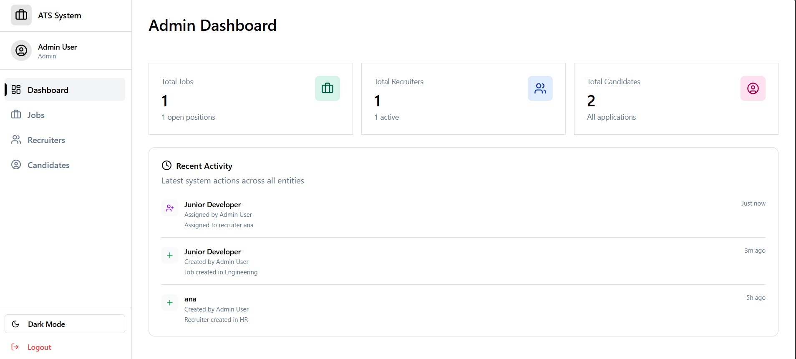
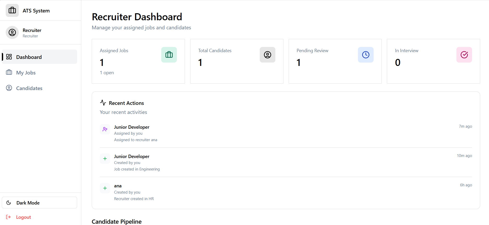
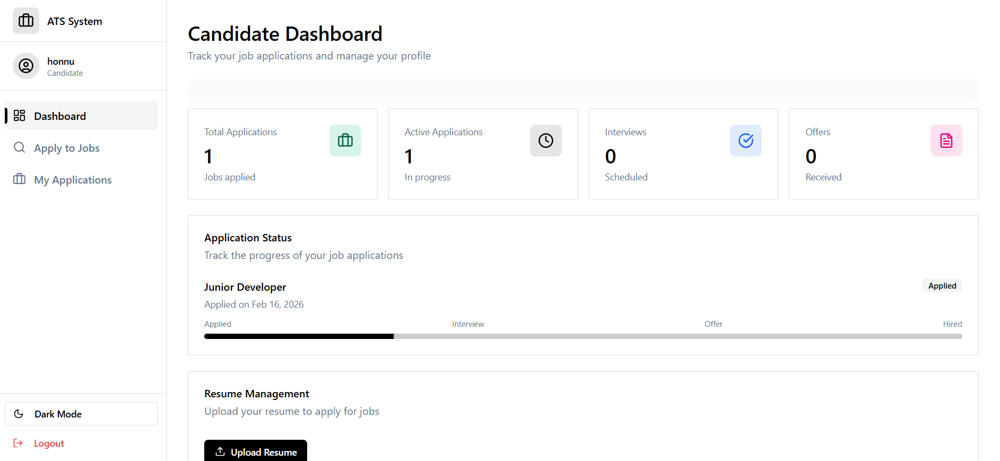

# HireNest

A role-based Applicant Tracking System (ATS) built with a focus on backend architecture, state management, and audit reliability.

---

##  Overview

HireNest is a full-stack Applicant Tracking System that supports three roles:

- **Admin**
- **Recruiter**
- **Candidate**

The system manages job creation, candidate applications, workflow state transitions, and maintains a reliable audit trail using background job processing.

---

##  Architecture Highlights

- **Role-Based Access Control (RBAC)**
- **Background Job Processing (Redis + Queue Worker)**
- **Audit Logging System**
- **Application State Validation Logic**
- **Pagination & Search**
- **Resume Upload Support**
- **Structured Backend (Service Layer + Middleware + Workers)**

---

##  Role Capabilities

###  Admin
- Dashboard with total:
  - Applications
  - Candidates
  - Recruiters
- Manage Jobs (Create / Assign / Update / Delete)
- View and manage candidates
- View paginated audit logs
- View recent system activity

---

###  Recruiter
- Dashboard with assigned job metrics
- Manage assigned jobs
- View and update candidate status
- View recent activity (top 4 logs)

---

###  Candidate
- Dashboard with application progress tracking
- Apply to jobs
- View applied jobs
- Upload / Update resume
- Track application stage visually

---

##  Application Workflow Logic

The system enforces controlled state transitions:

- Candidates cannot move directly to `Offer` or `Rejected` without reaching `Interview`
- Once marked `Rejected`, status cannot be changed
- Status transitions are validated at the backend layer

This ensures workflow integrity.

---

##  Audit Logging System

Every significant action triggers an audit event:

Stored Data:
- Action Type
- Entity Type
- Entity ID & Name
- Performed By (User ID + Name)
- Timestamp
- Additional Details

Audit events are processed asynchronously:

API Action → Redis Queue → Worker → Database (Prisma)

This prevents request blocking and improves system reliability.

---

##  Testing

- Unit Tests for core endpoints
- Integration test coverage
- Jest-based backend test setup

---

##  Tech Stack

**Frontend**
- React (Role-based UI)
- Axios

**Backend**
- Node.js
- Express
- Prisma ORM
- PostgreSQL
- Redis (Queue Processing)

---

##  Project Structure

backend/ prisma/ src/ middleware/ services/ utils/ workers/ routes/ frontend/

Layered architecture with separation of concerns.

---

## Application Screenshots

### Admin Dashboard

### Recruiter Dashboard

### Candidate Dashboard

---

##  Key Engineering Decisions

- Used Redis queue to decouple audit logging from request lifecycle
- Implemented backend state validation to prevent invalid workflow transitions
- Paginated large datasets to improve scalability
- Structured backend with service layer abstraction

---

##  Why This Project

This project focuses on:

- Backend system design
- Data integrity
- Clean architecture
- Practical role-based access patterns
- Production-like audit handling

---

##  Contact

Built and maintained by Honnu

<<<<<<< HEAD
---
=======

>>>>>>> d34953b (Added readme and screenshots)
